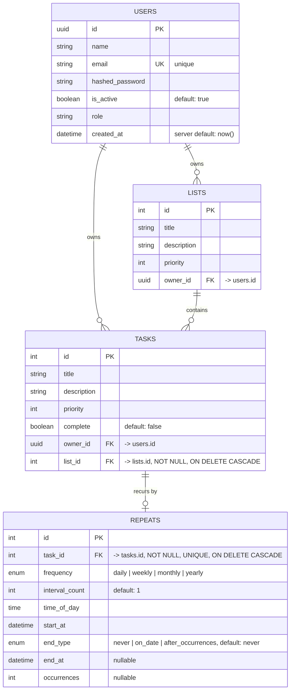

# Entity Relationship Diagram

This diagram reflects the schema as currently defined in `app/models/` (`User`, `List`, `Task`,
`Repeat`), not the full feature set described in the project README. See
[Not Yet Modeled](#not-yet-modeled) for fields on the Google Tasks roadmap that don't exist in the
schema yet.

## Diagram

## Entities

### `users` (`app/models/user.py`)

| Column            | Type            | Constraints                        |
| ------------------ | --------------- | ----------------------------------- |
| `id`                | UUID            | PK, default `uuid4()`               |
| `name`              | String          |                                      |
| `email`             | String          | unique                              |
| `hashed_password`   | String          |                                      |
| `is_active`         | Boolean         | default `true`                      |
| `role`              | String          | e.g. `user`, `admin`                |
| `created_at`        | DateTime (tz)   | server default `now()`              |

### `lists` (`app/models/list.py`)

| Column        | Type    | Constraints                     |
| -------------- | ------- | -------------------------------- |
| `id`           | Integer | PK                                |
| `title`        | String  |                                   |
| `description`  | String  |                                   |
| `priority`     | Integer |                                   |
| `owner_id`     | UUID    | FK &rarr; `users.id`, nullable   |

### `tasks` (`app/models/task.py`)

| Column        | Type    | Constraints                                          |
| -------------- | ------- | ----------------------------------------------------- |
| `id`           | Integer | PK                                                     |
| `title`        | String  |                                                        |
| `description`  | String  |                                                        |
| `priority`     | Integer |                                                        |
| `complete`     | Boolean | default `false`                                       |
| `owner_id`     | UUID    | FK &rarr; `users.id`, nullable                        |
| `list_id`      | Integer | FK &rarr; `lists.id`, **NOT NULL**, `ON DELETE CASCADE` |

### `repeats` (`app/models/repeat.py`)

Holds an optional recurrence rule for a single task. A task has at most one `repeats` row; a task
with none is a one-off task.

| Column           | Type            | Constraints                                                |
| ----------------- | --------------- | ------------------------------------------------------------ |
| `id`               | Integer         | PK                                                            |
| `task_id`          | Integer         | FK &rarr; `tasks.id`, **NOT NULL**, **UNIQUE**, `ON DELETE CASCADE` |
| `frequency`        | Enum            | `RepeatFrequency`: `daily`, `weekly`, `monthly`, `yearly`; **NOT NULL** |
| `interval_count`   | Integer         | **NOT NULL**, default `1` &mdash; the *N* in "every N days/weeks/…" |
| `time_of_day`      | Time            | **NOT NULL** &mdash; time of day the recurrence fires        |
| `start_at`         | DateTime (tz)   | **NOT NULL** &mdash; when the recurrence begins              |
| `end_type`         | Enum            | `RepeatEndType`: `never`, `on_date`, `after_occurrences`; **NOT NULL**, default `never` |
| `end_at`           | DateTime (tz)   | nullable &mdash; required by the API when `end_type = on_date` |
| `occurrences`      | Integer         | nullable &mdash; required by the API when `end_type = after_occurrences` |

`end_at`/`occurrences` are DB-nullable regardless of `end_type` (no `CheckConstraint` enforces the
pairing at the database level); `app/schemas/repeat.py`'s `RepeatRequest` validates that the correct
field is set for the chosen `end_type` before the row is written.

## Relationships

- **User &rarr; Lists** (1&ndash;N): a user owns zero or more lists (`lists.owner_id`).
- **User &rarr; Tasks** (1&ndash;N): a user owns zero or more tasks directly (`tasks.owner_id`).
- **List &rarr; Tasks** (1&ndash;N): a list contains zero or more tasks (`tasks.list_id`). Every task
  must belong to exactly one list. Deleting a list cascades and deletes its tasks
  (`ondelete="CASCADE"` at the DB level, `cascade="all, delete-orphan"` on the ORM relationship).
- **Task &rarr; Repeat** (1&ndash;0..1): a task optionally has one recurrence rule
  (`repeats.task_id`, unique). Omitting `repeat` on `TaskRequest` leaves the task non-recurring.
  Deleting a task cascades and deletes its repeat rule (`ondelete="CASCADE"` at the DB level,
  `cascade="all, delete-orphan"` on the ORM relationship, `uselist=False` making it one-to-one).

## Not Yet Modeled

The project description ("lists, tasks, due dates, priorities, labels") is aspirational for a full
Google Tasks clone. `priority` exists as a plain integer, and recurrence is now modeled via
`repeats`. The following still have no columns or tables and should be planned before the
router/schema work that depends on them:

- **Due dates on non-recurring tasks** &mdash; `repeats.start_at`/`time_of_day` only exist for tasks
  that have a recurrence rule; a plain one-off task (e.g. "due tomorrow, no repeat") has no
  schedule at all. Needs a `due_at` column on `tasks` independent of `repeats`.
- **Labels/tags** &mdash; likely a `labels` table plus a `task_labels` many-to-many join table, since
  a task can carry multiple labels and a label can apply to multiple tasks.
- **Subtasks** &mdash; Google Tasks supports one level of nested tasks; would need a self-referential
  `parent_id` on `tasks`.
- **Reminders/notifications** &mdash; out of scope until due dates exist.
